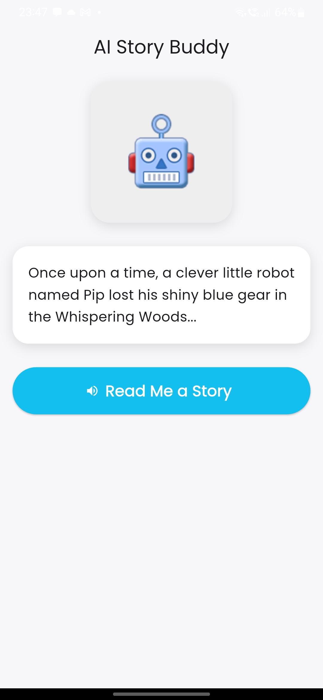
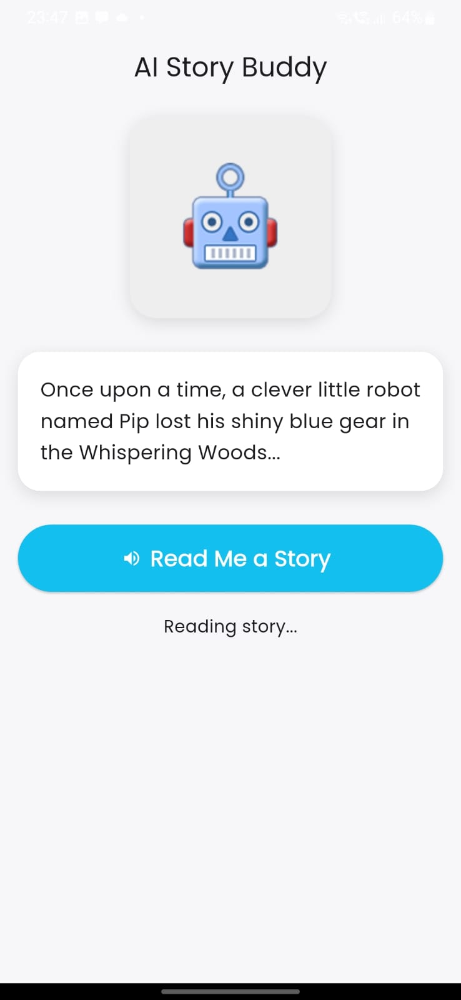
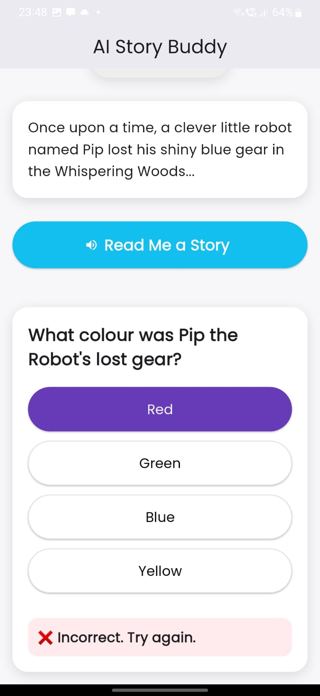
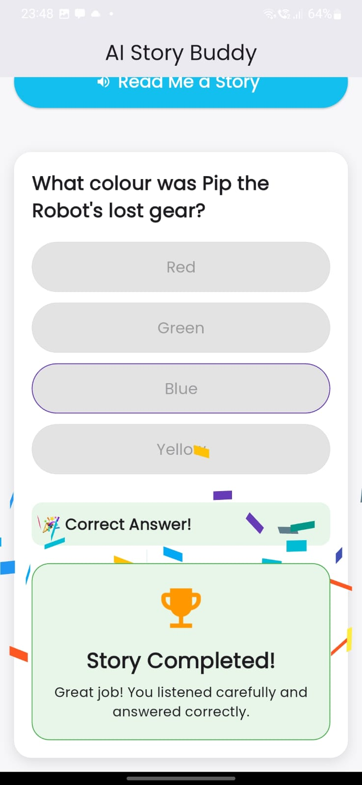

# 🤖 AI Story Buddy

AI Story Buddy is a Flutter application that reads stories aloud using Text-to-Speech (TTS) and then challenges users with an interactive quiz based on the story content. The app is designed to improve listening, comprehension, and engagement through a fun storytelling experience.

## 📱 Screenshots

| Story Screen | Story Narration |
|-------------|----------------|
|  |  |

| Quiz Screen | Success Screen |
|------------|---------------|
|  |  |

---

## ✨ Features

- 🔊 Story narration using Flutter TTS
- 🧠 Interactive quiz generated from story content
- ⚡ Riverpod state management
- 📳 Haptic feedback for user interactions
- 📜 Smooth auto-scrolling experience
- ✅ Correct and ❌ Incorrect answer feedback
- 🎉 Confetti celebration animation
- 🏆 Story completion screen
- 📱 Responsive and clean UI design

---

## 🛠 Tech Stack

- Flutter
- Dart
- Flutter Riverpod
- Flutter TTS
- Flutter Animate
- Confetti
- Vibration

---

## 📂 Project Structure

```text
lib/
├── core/
├── features/
│   ├── story/
│   └── quiz/
└── main.dart
```

---

## 🚀 Getting Started

### Prerequisites

- Flutter SDK
- Android Studio / VS Code
- Android Emulator or Physical Device

### Installation

1. Clone the repository

```bash
git clone https://github.com/your-username/ai-story-buddy.git
```

2. Navigate to the project directory

```bash
cd ai-story-buddy
```

3. Install dependencies

```bash
flutter pub get
```

4. Run the application

```bash
flutter run
```

---

## 🎯 How It Works

1. User taps **"Read Me a Story"**
2. The story is narrated using Text-to-Speech
3. After narration, a quiz appears automatically
4. User selects an answer
5. Instant feedback is displayed
6. Correct answers trigger a celebration animation and completion screen

---

## 📦 Packages Used

| Package | Purpose |
|----------|----------|
| flutter_riverpod | State Management |
| flutter_tts | Text-to-Speech |
| flutter_animate | UI Animations |
| confetti | Celebration Effects |
| vibration | Haptic Feedback |

---

## 👨‍💻 Author

**Sushant Kumar Suman**

- Flutter Developer
- B.Tech CSE Student

GitHub: https://github.com/sushant

---

## 📄 License

This project is developed for learning and demonstration purposes.
## 🔮 Upcoming Features

- Upload PDF storybooks
- Extract story content from PDF files
- Automatically generate quizzes from uploaded stories
- Multiple quiz questions per story
- Score tracking
- Story history and progress tracking
